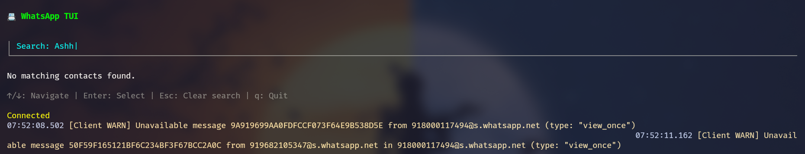

# 📱 WhatsApp TUI Messenger (Go + Bubble Tea)

[](https://golang.org/)
[](https://github.com/yourusername/whatsapp-tui-go/actions)


A terminal-based WhatsApp messenger built in Go using [go-whatsapp](https://github.com/Rhymen/go-whatsapp) and the [Bubble Tea](https://github.com/charmbracelet/bubbletea) TUI framework. Send messages and files directly from your terminal to WhatsApp contacts with ease.

---

## ✨ Features

- 🔍 Search and filter contacts from a local JSON file
- 💬 Compose and send multi-line WhatsApp messages
- 📄 Maintain local contact list in `contacts.json`
- 🖥️ Smooth terminal UI with keyboard navigation
- 🔐 QR-based login (session saved locally)
- 🧠 Written entirely in Go (no browser or Node.js required)

---

## 📸 Screenshots

```md



## 📦 Installation
### 1. Clone the repository
```bash
git clone https://github.com/Ashank007/whatsapp-tui-go.git
cd whatsapp-tui-go
```
### 2. Install Go modules
```bash
go mod tidy
```
### 3. Build the binary
```bash
go build -o whatsapp-tui
```
### 4. Run the app
```bash
./whatsapp-tui
```

If you dont want to take so much headache do one thing download the binary file from the repo itself for ur OS type and place it in a folder where contacts.json is present and then run it directly.

### Contacts.json Format
Create a contacts.json file in the root directory with this format:

```json
[
  {
    "name": "Alice",
    "phone": "1234567890"
  },
  {
    "name": "Bob",
    "phone": "9876543210"
  }
]

```
### Important:

#### 1. Phone numbers must be in international format, without + (e.g., 919876543210 for India).

#### 2. No dashes, spaces, or special characters.

## 🔑 QR Code Login

#### 1. On first run, a QR code appears in your terminal.

#### 2. Open WhatsApp → Linked Devices → Link a Device.

#### 3. Scan the code.

#### 4. Your session is saved to session.gob for reuse.

## 🔄 Can It Receive Messages?

#### ❌ Currently, receiving messages is not reliable due to WhatsApp’s multi-device architecture. The focus is on sending.

## ⚠️ Disclaimer

#### This project uses an unofficial WhatsApp Web API, which may stop working if WhatsApp changes its internal protocol. Use responsibly. This is meant for educational or personal use only.

## 🙌 Contributing

Pull requests are welcome! If you have ideas for improvement, feel free to open an issue or PR.


## 📄 License

MIT License
© 2025 Ashank Gupta

